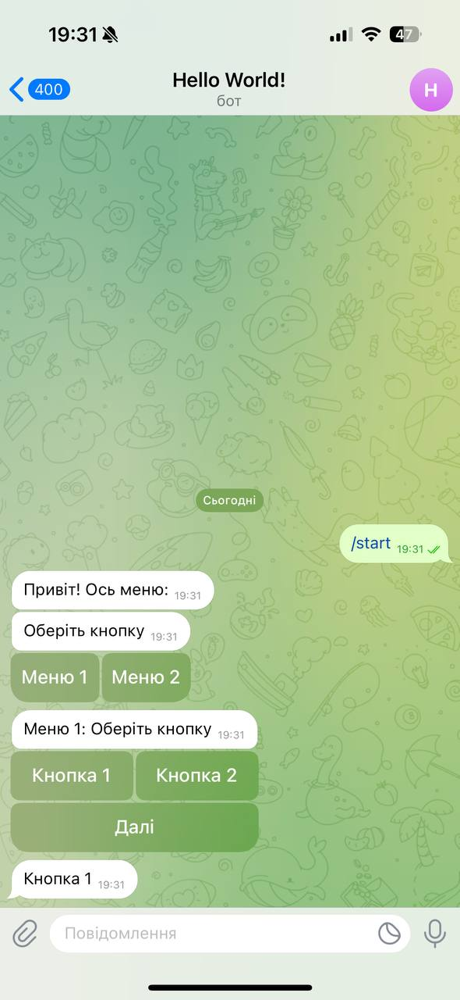

# Telegram Bot Example (Hello World) 

This project implements a simple Telegram bot using Spring Boot, which has a two-level menu. The bot responds to user commands and allows you to navigate between different menus using a button interface.

### Description

The Telegram bot responds to the /start command and displays the main menu with two buttons:

* Menu 1 
* Menu 2 

Menu 1 :

Button 1 – displays the message "Button 1".
Button 2 – displays the message "Button 2".
Button "Next" – goes to the second menu.

The second menu has three more buttons:

Button 1 – displays the message "Button 1".
Button 2 – displays the message "Button 2".
Button "Back" – returns the user to the first menu.
 
# Examples

